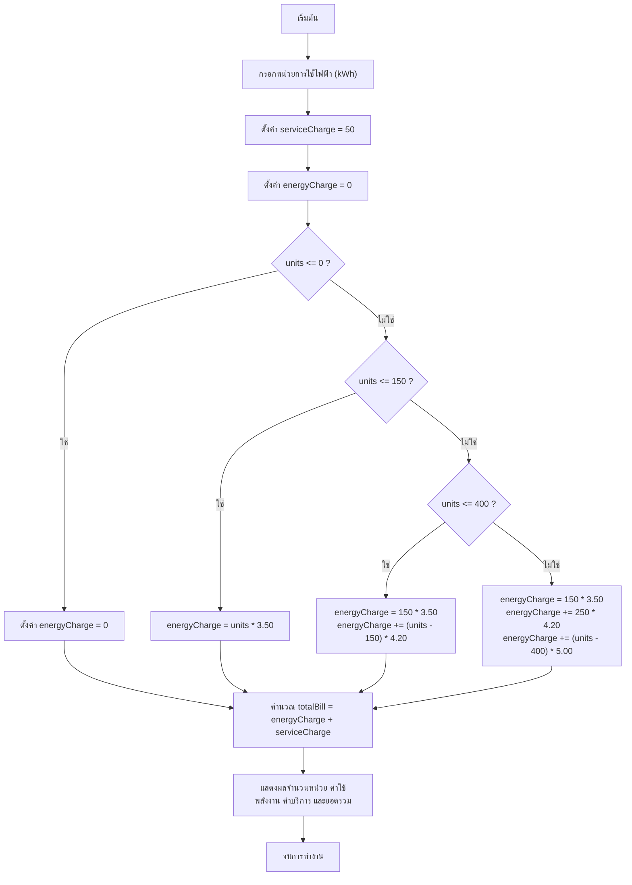

## แผนภาพลำดับงานการคำนวณค่าไฟฟ้า (Flowchart)

แผนภาพลำดับงานนี้แสดงขั้นตอนการทำงานของโปรแกรมคำนวณค่าไฟฟ้าแบบขั้นบันได พร้อมค่าบริการคงที่ 50 บาท ตามรหัสเทียม (Pseudocode) ในไฟล์ README.md

```mermaid
flowchart TD
    A[เริ่มต้น] --> B["กรอกหน่วยการใช้ไฟฟ้า (kWh)"]
    B --> C[ตั้งค่า serviceCharge = 50]
    C --> D[ตั้งค่า energyCharge = 0]
    D --> E{units <= 0 ?}

    E -- ใช่ --> F[ตั้งค่า energyCharge = 0]
    F --> M[คำนวณ totalBill = energyCharge + serviceCharge]

    E -- ไม่ใช่ --> G{units <= 150 ?}
    G -- ใช่ --> H[energyCharge = units * 3.50]

    G -- ไม่ใช่ --> I{units <= 400 ?}
    I -- ใช่ --> J["energyCharge = 150 * 3.50\nenergyCharge += (units - 150) * 4.20"]
    I -- ไม่ใช่ --> K["energyCharge = 150 * 3.50\nenergyCharge += 250 * 4.20\nenergyCharge += (units - 400) * 5.00"]

    H --> M
    J --> M
    K --> M

    M --> N["แสดงผลจำนวนหน่วย ค่าใช้พลังงาน ค่าบริการ และยอดรวม"]
    N --> O[จบการทำงาน]
```
